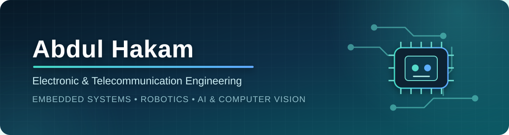

  

## Hello, I'm Abdul

I'm an **Electronic and Telecommunication Engineering undergraduate at the University of Moratuwa**, interested in building reliable products where hardware and software meet.

My projects span embedded systems, robotics, analog and digital electronics, PCB design, computer vision, and full-stack applications. I enjoy taking ideas through the complete engineering cycle—from circuit and mechanical design to firmware, interfaces, integration, and testing.

- Currently exploring **embedded intelligence, robotics, and computer vision**
- Building and operating software for my own computer-products business, **Gatronix Store**
- Comfortable moving between the workbench, firmware, data, and user interfaces
- Based in **Sri Lanka**

## What I build

<table>
  <tr>
    <td width="33%" valign="top">
      <h3>🤖 Embedded & Robotics</h3>
      STM32, ESP32, Arduino, Raspberry Pi, sensors, motor control, communication protocols, autonomous navigation, and real-time firmware.
    </td>
    <td width="33%" valign="top">
      <h3>⚡ Electronics & Product Design</h3>
      Analog and digital circuits, schematic capture, PCB layout, prototyping, soldering, debugging, enclosure design, and system integration.
    </td>
    <td width="33%" valign="top">
      <h3>🧠 AI & Software</h3>
      Computer vision, classical machine learning, Python, React, Spring Boot, Flutter, Supabase, and practical business applications.
    </td>
  </tr>
</table>

## Featured projects

<table>
  <tr>
    <td width="50%" valign="top">
      
      <h3><a href="https://github.com/hakammra/Restaurent-Robot">Servie — Restaurant Delivery Robot</a></h3>
      Autonomous food-delivery robot with magnetic-line navigation, encoder feedback, ultrasonic obstacle detection, load sensing, custom electronics, and a web interface.
        
      <code>ESP32-S3</code> <code>STM32</code> <code>C/C++</code> <code>PCB Design</code> <code>React</code>
    </td>
    <td width="50%" valign="top">
      
      <h3><a href="https://github.com/hakammra/asl-fingerspelling-webcam">Real-Time ASL Fingerspelling</a></h3>
      Webcam system that learns static ASL poses from normalized 3D hand landmarks and recognizes them live using confidence filtering and temporal voting.
        
      <code>Python</code> <code>MediaPipe</code> <code>OpenCV</code> <code>scikit-learn</code>
    </td>
  </tr>
</table>

### More engineering work

- **[FallTrack Smart Watch](https://github.com/hakammra/falltrack-watch)** — wearable fall detection and heart-rate monitoring with ESP8266, MPU6050, MAX30102, Flutter, and a custom PCB.
- **[WaveSync RF Alarm](https://github.com/hakammra/wavesync-rf-alarm)** — microcontroller-free alarm system using digital logic, an R-2R DAC, comparators, and 433 MHz OOK communication.
- **[Analog Automatic Gain Controller](https://github.com/hakammra/automatic-gain-controller)** — audio AGC built around NE5532 op-amps, feedback control, peak detection, and a JFET voltage-controlled resistor.
- **[Gatronix Retail POS](https://github.com/hakammra/Shop-POS)** and **[Wholesale System](https://github.com/hakammra/gs-wholesale)** — operational sales, purchasing, stock, account, payment, and reporting workflows built for a real business.
- **[UART on FPGA](https://github.com/hakammra/uart-fpga-assignment)** — UART implementation and verification using Verilog.

## Technical toolbox

### Programming and software

### Embedded, electronics, and design

## Competitions and achievements

| Achievement | Result |
|---|---|
| Robotics Design and Competition Module | Built the best-performing arena navigation and task-completion robot — 2025 |
| SLIoT Challenge | Semifinalist with a flood early-warning system — 2026 |
| SPARK 25/26 | Semifinalist with a flood early-warning system |
| [OCTWAVE 3.0 Kaggle Challenge](https://www.kaggle.com/competitions/oct-wave-3-0-kaggle-challenge-02/) | Advanced to Round 2 and placed 16th — 2026 |
| Sri Lankan Robotics Challenge | University-category participant — 2025 |
| ROSCO | Robotics competition participant — 2026 |

## GitHub activity

  
  

Language statistics describe public repository contents and do not necessarily represent proficiency.

## Education and continuous learning

**B.Sc. Engineering (Hons.) in Electronic and Telecommunication Engineering**  
University of Moratuwa, Sri Lanka · 2024–Present

- [Data Science in Python](https://coursera.org/share/69ed6d560fb6cae274a7b942a063e437) — Coursera
- [Full-Stack Web Development Bootcamp](https://www.udemy.com/certificate/UC-d1fc56d8-7a1a-4d06-b1b0-0b52c314f286/) — Udemy

---

  <b>Interested in embedded systems, robotics, electronics, AI, or product development?</b> 
  <a href="mailto:abdulhakam646@gmail.com">Let's connect.</a>

